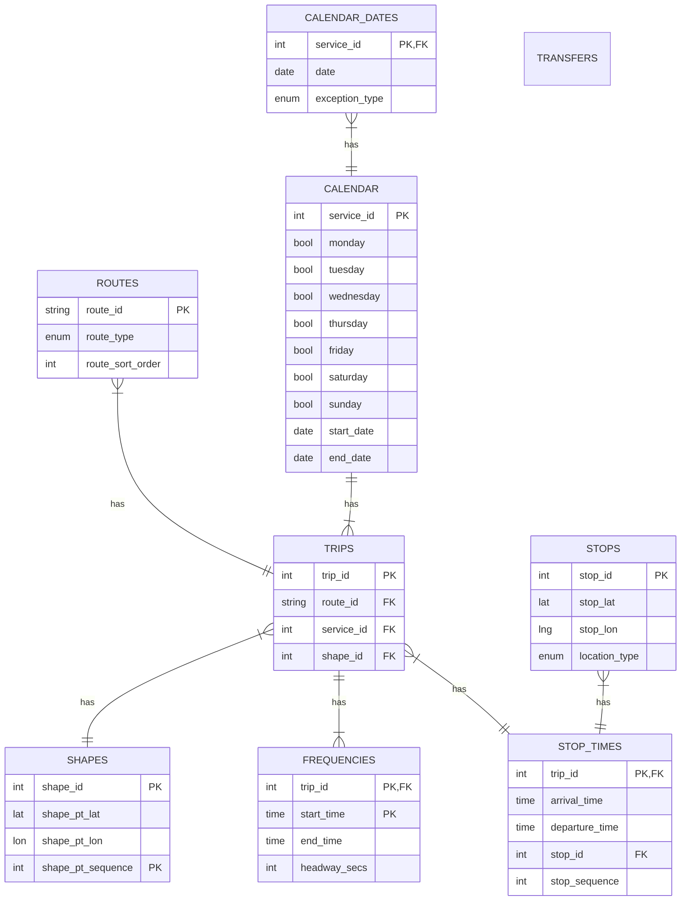
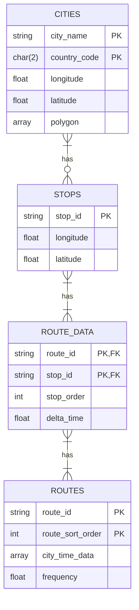

# Databases

## GTFS
Holds the entire ground truth in `gtfs` tables.

### non-exhaustive ER Diagram

## EPTC
Holds the entire preprocessed data that the European Public Transport Connectivity project will display and work with.

